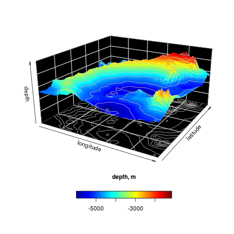

php-rdk
=======
Integrating PHP and R

Purpose
-------
Sometimes there is a need to make complex calculations and analyze the data, but your application is written 
in PHP. As is known that PHP a badly programming language for statistics calculation and data manning. But R is a language 
and environment for statistical computing and graphics. So this library provide integration between R and PHP.

Example
-------

#### Run R script
```php
use Okvpn\R\Process\RProcess;
use Okvpn\R\UnixPipes;

$rPath = '/usr/bin/R'; //path to R
$process = new RProcess(new UnixPipes(), $rPath);
$process->start();

$rOutput = $process->write(<<<TXT
library("plot3D")
ii = which(Hypsometry\$x > -50 & Hypsometry\$x < -20)
jj = which(Hypsometry\$y > 10 & Hypsometry\$y < 40)
zlim = c(-10000, 0)
png('test.png')
persp3D(z = Hypsometry\$z[ii,jj], xlab = "longitude", bty = "bl2", ylab = "latitude", zlab = "depth", clab = "depth, m", expand = 0.5, d = 2, phi = 20, theta = 30, resfac = 2, contour = list(col = "grey", side = c("zmin", "z")), zlim = zlim, colkey = list(side = 1, length = 0.5))
dev.off()
TXT
);

print_r($rOutput->getAllOutput());
```

Output image `/tmp/test.png`:



#### Use expression builder

```php
use Okvpn\R\Process\ProcessManager;
use Okvpn\R\Types\Type;

$rProcess = ProcessManager::create();
$exprBuilder = $rProcess->createExpressionBuilder();

$result = $exprBuilder
    ->select('t(combn(c(0:3), :b))', Type::MATRIX)
    ->setParameter('b', $b)
    ->execute()->getSingleResult();
```

License
-------
MIT License. See [LICENSE](LICENSE).
